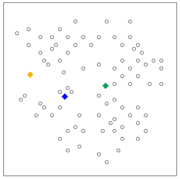
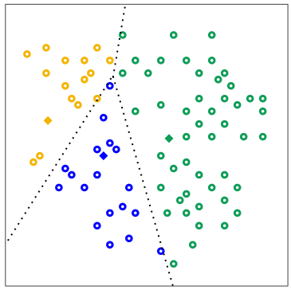

# ¿Qué es un Outlier?

> Es un objeto que tiene características diferentes de la mayoria de otros del dataset
> con el que estemos trabajando. También puede ser un valor inusual con respecto
> a los valores típicos de una variable.

Por ejemplo, si tenemos un dataset con la información de la altura
de un grupo de personas, y el promedio es de 1.80 metros, un outlier sería ver un valor de 2.15 metros.

La naturaleza de los outliers es dual, así como pueden ser el resultado de errores de medición o entrada
de datos, también pueden representar eventos geniunos pero poco frencuentes que aún nos pueden dar
información valiosa del conjunto de datos. @Munoz_outliers

## ¿Por qué es importante detectar los outliers?

Si estos valores no se identifican ni procesan de una manera adecuada perjudica considerablemente
los análisis estadísticos que se hagan de nuestros datos, ya que puede sesgar el modelos, reducir
su precisión y/o comprometer su interpretabilidad.

Sin embargo la decisión de cómo manejar un outlier debe precederse por una investigación sobre _por
qué existe_. Si un outlier es claramente el resultado de un error su eliminación o corrección es
justificada. Sin embargo, si el outlier representa un evento genuino y válido, pero tal vez menos probable,
debe ser considerado cuidadosamente o incluso aprovechado para obtener información valiosa. @Pontia_2026

## Outliers y Ruido

Algo que vale la pena recalcar es que un outlier **no es lo mismo** que el ruido. Mientras que el ruido
son datos incorrectos o inconsistentes que restan la calidad del modelo que se vaya a crear, un outlier
es más un valor que es posible pero muy poco frecuente.

# Categorización de Outliers

## Outliers Globales

Son los outliers menos específicos. Son eventos que se desvían significativamente del resto del
dataset. Por ejemplo, un conjunto de datos de edad de personas en una empresa y un dato anómalo de
150 años.

## Outliers Contextuales

Estos eventos se consideran atípicos según el contexto específico bajo el que se vayan a tratar.
Por ejemplo, si nuestro dataset es sobre temperaturas en un estado a lo largo del año, un valor
de 30°C es normal en verano, pero atípico en invierno.

## Outliers Colectivos

Como su nombre lo dice, son eventos que aunque de manera individual no parecen ser anómalos, en conjunto
si representan una anomalía. Por ejemplo, el rechazo de envío de un paquete de una computadora a otra se
considera normal, pero si varias computadoras continúan enviando paquetes rechazados unas a otras, el
conjunto se debería considerar como outlier colectivo. @MineriaDatos_R


# ¿Qué signfica _clustering_?

> El clustering es una técnica de aprendizaje automático no supervisado que busca dividir el dataset
> en el que se este trabajando en grupos, a los que llamaremos *_clústers_*, en donde los elementos
> que se encuentran dentro de uno son lo más similares entre si y lo más distintos posibles o los de
> otro clúster.

Como es un método no supervizado no se necesita que los datos tengan etiquetas, clasificaciones
previas o ejemplos de entrenamiento, si no que más bien lo que se busca es encontrar la distancia
matemática (o similitud) entre cada dato para agruparlos lo más correctamente posible.

## ¿De qué nos sirven los clústers?

- **Descubrir patrones ocultos**: Ayuda a revelar relaciones, estructuras y agrupaciones naturales dentro
de los datos que no son evidentes a simple vista.
- **Simplificar información compleja**: Permite dividir y resumir grandes volúmenes de datos ruidosos en
subgrupos más pequeños, homogéneos y manejables.
- **Exploración y descubrimiento**: Es sumamente útil para encontrar grupos de datos o categorías que eran
previamente desconocidas por los analistas.

# Algoritmos de Clustering

## Términos Generales de los Algoritmos de Clústering

1. El algoritmo evalúa cada registro del conjunto de datos tomando en cuenta sus características como
si fueran coordenadas de un punto en el espacio.
2. Luego, usamos métricas (como la distancia euclídea o la correlación) para medir qué tan cerca están
esos puntos unos de otros
3. Con base en esta proximidad, el algoritmo asocia los puntos de modo que se minimice la distancia entre
los elementos de un mismo grupo (haciéndolos muy compactos y similares) y se maximice la separación con los
demás grupos.

### Ejemplo Corto

Digamos que tenemos un dataset de compras de un supermercado. Cada entrada en el conjunto se refiere a
lo que compra una persona y queremos detectar grupos basados en clustering en base a esos datos. Entonces
el algoritmo puede agrupar en "compradores frecuentes", "compradores nuevos", "compradores de un solo
artículo", etc. Y en base a estas métricas el supermercado puede encontrar patrones de los artículos más
vendidos, etc.

## K-Means

El algoritmo de K-Means es uno de los métodos de clustering más populares y ampliamente utilizados. Su
objetivo es dividir un conjunto de datos en $k$ clústers distintos, donde $k$ es un número
predefinido por el usuario. Funciona de la siguiente manera:

- Tomamos $k$ datos (o puntos) aleatorios como los centros iniciales (o _centroides_) de cada clúster.
- Asignamos el resto de los datos a el clúster más cercano calculando su distancia a cada centro
y asignandolo al de menor distancia.
- Una vez que todos los datos han sido asignados a un clúster, el algoritmo recalcula los centros
de cada clúster tomando la media de los puntos asignados a ese clúster.
- Repetimos los pasos de asignación y recalculo de centros hasta que las asignaciones de los puntos no cambien
significativamente o se alcance un número máximo de iteraciones.

### Visualizando K-Means

Por ejemplo, en las siguientes imágenes tenemos un dataset con una $n$ cantidad de datos. Vamos a tomar
$k=3$ y seleccionamos 3 puntos aleatorios y los marcamos con azul, verde y amarillo. De esto creamos
los primeros clústeres basándonos en la distancia de cada punto al centroide. Luego, recalculamos los
centroides tomando la media de los puntos asignados a cada clúster y repetimos el proceso hasta que los
clústeres no cambien significativamente. @Google_kMeans

::: {layout-ncol=2}
{width=80%, #fig:paso1_kmeans}

{width=80%, #fig:paso2_kmeans}

{width=80%, #fig:paso3_kmeans}

{width=80%, #fig:paso4_kmeans}
:::

### La Regla del Codo

¿Y cómo sabemos cual es el valor correcto de $k$ a considerar? El método del codo sirve justo para esto. 
Funciona de la siguiente manera:

- Ejecutamos $k$-Means para diferentes valores de $k$ (por ejemplo, desde 1 hasta 10).
- Para cada valor de $k$, calculamos la _inercia_, que es la suma de las distancias al cuadrado entre cada
punto y su centroide asignado. Esta inercia representa qué tan bien se ajustan los datos a los clústers formados.
- Luego, graficamos la inercia en función de $k$ y buscamos el punto donde la disminución de la inercia comienza 
a ser menos pronunciada, formando una especie de codo (de ahi el nombre).
- El punto resultante suele ser la mejor elección para el número óptimo de clústers, ya que representa un 
buen equilibrio entre la complejidad del modelo (número de clústers) y la calidad del ajuste (inercia).

#### Ejemplo usando el método del codo

Vamos a crear un conjunto de datos aleatorios usando la función `make_blobs` de `sklearn.datasets`, 
que genera datos agrupados en clústers. Luego, aplicaremos el método del codo para determinar el número óptimo 
de clústers. Consideraremos que el número máximo de clústers a evaluar es 10, pero esto puede ajustarse según 
las necesidades del análisis.

```{python}
import matplotlib.pyplot as plt
from sklearn.cluster import KMeans
from sklearn.datasets import make_blobs

def elbow_method(data, max_clusters=10):
    """
    Aplica el método del codo para seleccionar el número óptimo de clusters en k-means.

    Parámetros:
    ----------
    data : matriz o matriz dispersa, forma (n_samples, n_features)
        Los datos de entrada.

    max_clusters : int, opcional (por defecto=10)
        El número máximo de clusters a considerar.
    """

    sum_of_squared_distances = []

    for k in range(1, max_clusters+1):
        kmeans = KMeans(n_clusters=k)
        kmeans.fit(data)
        sum_of_squared_distances.append(kmeans.inertia_)

    # Graficar la curva del codo
    plt.plot(range(1, max_clusters+1), sum_of_squared_distances, 'bx-')
    plt.xlabel('Número de Clusters (k)')
    plt.ylabel('Suma de las Distancias al Cuadrado')
    plt.title('Curva del Codo')
    plt.show

# Genera un conjunto de datos de ejemplo con 4 clusters
data, _ = make_blobs(n_samples=500, centers=4, n_features=2, random_state=42)   
# Aplica el método del codo
elbow_method(data)
```

En este ejemplo, vemos que el valor se reduce significativamente hasta $k=4$, lo que sugiere que 
4 es el número óptimo de clústers para este conjunto de datos. @Rodríguez_Codo

# Referencias

::: {#refs}
:::
