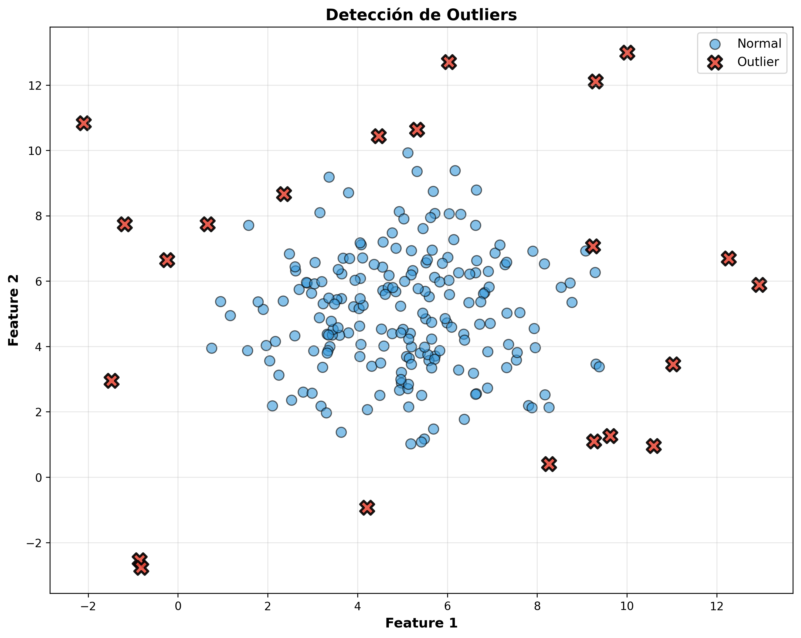
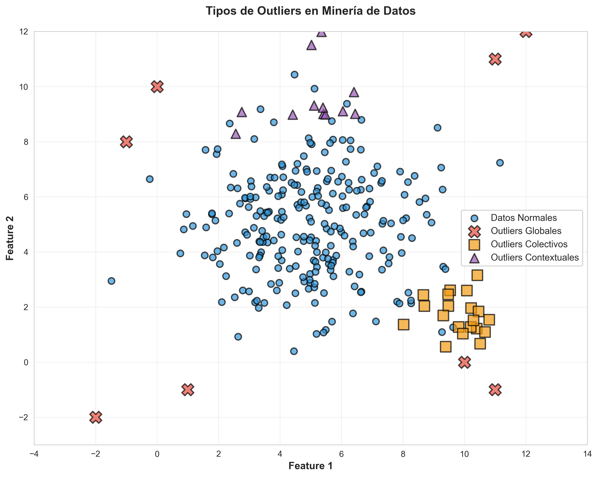
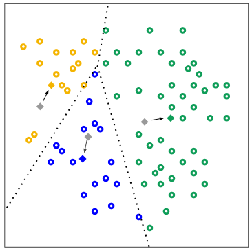
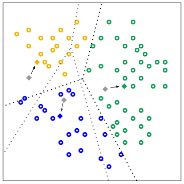

# ¿Qué es un Outlier?

> Objeto con características diferentes de la mayoria de otros del dataset
> con el que estemos trabajando. También puede ser un valor inusual con respecto
> a los valores típicos de una variable.

Pueden ser el resultado de errores de medición o entrada de datos y aun así
representar eventos geniunos pero poco frencuentes que dan información valiosa
del dataset.

---

{width=70%, #fig:visualizacion-outliers}

# Z-Score y el IQR

- El **Z-Score** ($Z = \frac{X - \mu}{\sigma}$) mide cuántas desviaciones estándar se encuentra un valor de la media.
Un valor de <-3 o >3 suele considerarse un outlier.
- El **IQR** es la diferencia entre el tercer cuartil (Q3) y el primer cuartil (Q1) de un conjunto de datos. Un dato
se considera un outlier si es menor que $Q1 - 1.5 \times IQR$ o mayor que $Q3 + 1.5 \times IQR$.

# ¿Por qué es importante detectar y procesar los outliers?

Entre varias razones, las 3 que más destacan son:

- Perjudica los análisis estadísticos que se hagan de nuestros datos.
- Sesga el modelo al reducir su precisión.
- Compromete su interpretabilidad.

# Outliers y Ruido

Outlier ***no es lo mismo** que el ruido*.

**Ruido son datos incorrectos o inconsistentes** que restan la calidad del modelo.

Un **outlier** es más un **valor que es posible pero muy poco frecuente**.

# Clasificación de Outliers

> Globales: Son eventos que se desvían significativamente del resto del dataset.  
*Ejemplo:* una persona de 150 años en un dataset de edades en una empresa.

> Contextuales: Eventos atípicos según el contexto específico bajo el que se vayan a tratar.  
*Ejemplo:* en un dataset de temperaturas, 30°C es normal en verano, pero atípico en invierno.

> Colectivos: nEventos que individualmente no parecen anómalos, pero sí en conjunto.  
*Ejemplo:* el rechazo de envío de paquetes entre dos computadoras es normal, pero atípico si ocurre entre varias más.

---

{width=80%}


# ¿Qué signfica _clustering_?

> Técnica de aprendizaje automático no supervisado que busca dividir el dataset
> en grupos llamados *_clústers_*, en donde los elementos dentro de uno son lo más
> similares entre si y lo más distintos posibles de los de otro clúster.

Como es un método no supervizado no se necesita que los datos tengan etiquetas, clasificaciones o categorías
predefinidas para que el algoritmo pueda identificar patrones y agrupar los datos de manera efectiva.

# ¿De qué nos sirven los clústers?

- **Descubrir patrones ocultos**: Ayuda a revelar relaciones, estructuras y agrupaciones naturales dentro
de los datos que no son evidentes a simple vista.
- **Simplificar información compleja**: Permite dividir y resumir grandes volúmenes de datos ruidosos en
subgrupos más pequeños, homogéneos y manejables.
- **Exploración y descubrimiento**: Es sumamente útil para encontrar grupos de datos o categorías que eran
previamente desconocidas por los analistas.


# ¿Qué hace un algoritmo de clustering?

1. Se evalúa cada registro tomando en cuenta sus características como si fueran coordenadas de un punto en el espacio.
2. Usamos métricas (distancia euclídea, correlación, etc) para medir qué tan cerca están esos puntos unos de otros.
3. El algoritmo asocia los puntos en base a esa métrica de modo que los elementos de un mismo grupo estén lo más cerca
posible entre si y lo más lejos posible de los de otro clúster.

# Distancia Euclídea

La distancia euclídea mide la longitud del segmento de línea recta entre los puntos $P$ y $Q$ en el
espacio n-dimensional. Cuanto menor sea esta distancia, más similares son los puntos entre sí.

$$d(P, Q) = \sqrt{\sum_{i=1}^{n} (p_i - q_i)^2}$$

Donde:

- $P$ y $Q$ son dos puntos en un espacio n-dimensional, representados por sus coordenadas $p_i$ y $q_i$
respectivamente.
- $n$ es el número de dimensiones o características que describen cada punto.


# K-Means 

- Tomamos $k$ datos (o puntos) aleatorios como los centros iniciales (_centroides_) de cada clúster.
- Asignamos el resto de los datos a el clúster más cercano calculando su distancia a cada centro
y asignandolo al de menor distancia.
- Una vez que todos los datos han sido asignados a un clúster, el algoritmo recalcula los centros
de cada clúster tomando la media de los puntos asignados a ese clúster.
- Repetimos los pasos de asignación y recalculo de centros hasta que las asignaciones de los puntos no cambien
significativamente o se alcance un número máximo de iteraciones.

# Centroides

Puntos que representan el centro de cada clúster. Se calculan tomando la media de las coordenadas de los puntos 
asignados a cada clúster, siendo así la "coordenada promedio" de los puntos dentro del clúster.

$$\mu_i = \frac{1}{|S_i|} \sum_{x \in S_i} x$$

Donde:

- $\mu_i$ es el centroide del clúster $i$,
- $S_i$ es el conjunto de puntos asignados al clúster $i$
- $|S_i|$ es el número de puntos en el clúster $i$,
- $x$ representa cada punto dentro del clúster $i$.

# La Inercia de K-Means

Es la suma de las distancias al cuadrado entre cada punto y el centroide de su clúster asignado.
Es una medida de qué tan bien se ajustan los datos a los clústers formados.

$$\sum_{j=1}^{k} \sum_{x \in S_j} d(x, \mu_j)^2$$

Donde:

- $S_j$ es el conjunto de puntos asignados al clúster $j$,
- $\mu_j$ es el centroide del clúster $j$,
- $d(x, \mu_j)$ es la distancia entre el punto $x$ y el centroide $\mu_j$.

---

::: {layout-ncol=2}
{width=10%, #fig:paso1_kmeans}

{width=10%, #fig:paso2_kmeans}
:::

---

::: {layout-ncol=2}

{width=10%, #fig:paso3_kmeans}

{width=10%, #fig:paso4_kmeans}
:::


# Ejemplo de Uso: El consumo eléctico en hogares

Para ilustrar el funcionamiento de k-means en la detección de datos atípicos, analizaremos un dataset
real de consumo eléctrico doméstico, proveniente del [repositorio UCI](https://archive.ics.uci.edu/dataset/235/individual+household+electric+power+consumption).
Este dataset contiene mediciones minuto a minuto de la potencia activa consumida y el voltaje
registrado en una vivienda francesa desde Diciembre de 2006 hasta Noviembre de 2010.

---

```{python}
#| fig-width: 18
#| fig-height: 9.5
#| fig-dpi: 200
#| out-width: "100%"
#| fig-align: center

import pandas as pd
import numpy as np
import matplotlib.pyplot as plt
from sklearn.cluster import KMeans
from sklearn.datasets import make_blobs
import plotly.express as px
from sklearn.preprocessing import StandardScaler

# Cargamos el dataset y seleccionamos/limpiamos las variables de interés
df = pd.read_csv('datasets/household_power_consumption.txt', sep=';', nrows= 10000, low_memory=False)
df_limpio = df[['Global_active_power', 'Voltage']].replace('?', np.nan).dropna().astype(float)
scaler = StandardScaler()
df_scaled = scaler.fit_transform(df_limpio)

# Aplicamos k-means para agrupar los datos en clústers y detectar atípicos
# Como mencionabamos, vamos a suponer $k=8$. Pero como saber si este es el valor
# correcto?
kmeans = KMeans(n_clusters=8, random_state=42)
df_limpio['Cluster'] = kmeans.fit_predict(df_scaled)

# Obtenemos las coordenadas de los centroides y calculamos la distancia de cada punto a su centroide correspondiente
centroides = kmeans.cluster_centers_
distancias = np.sqrt(np.sum((df_scaled - centroides[df_limpio['Cluster']]) ** 2, axis=1))

# El porcentaje de los datos más lejanos a cualquier clúster se consideran atípicos
umbral = np.percentile(distancias, 99)  # Ajustable según el nivel de sensibilidad deseado
df_limpio['Es_Atipico'] = distancias > umbral

# Creamos una columna de texto para formatear las leyendas de forma clara
df_grafico = df_limpio.copy()
df_grafico['Clasificación'] = df_grafico['Cluster'].astype(str)
df_grafico.loc[df_grafico['Es_Atipico'], 'Clasificación'] = 'Atípico'

# Mapa de colores: clústeres comunes y rojo para anomalías
mapa_colores = {
    '0': '#1f77b4',      # Azul
    '1': '#2ca02c',      # Verde
    '2': '#9467bd',      # Morado
    '3': '#bcbd22',      # Amarillo
    '4': '#17becf',      # Cian
    '5': '#e377c2',      # Rosa
    '6': '#ff7f0e',      # Naranja
    '7': '#8c564b',      # Café
    '8': '#7f7f7f',      # Gris
    '9': '#ffbb78',      # Naranja claro
    'Atípico': '#d62728' # Rojo para Outliers
}

# Construcción del scatter plot interactivo
fig = px.scatter(
    df_grafico,
    x='Global_active_power',
    y='Voltage',
    color='Clasificación',
    color_discrete_map=mapa_colores,
    symbol='Clasificación',
    opacity=0.6,
    size=[8]*len(df_grafico),
    title='Detección de Atípicos (K-Medias)',
    labels={
        'Global_active_power': 'Potencia Activa Global (kW)',
        'Voltage': 'Voltaje (V)'
    },
    hover_data={'Cluster': True, 'Es_Atipico': False} # Muestra datos limpios al pasar el cursor
)

fig.update_layout(
    legend_title_text='Estructura del Dataset',
    margin=dict(l=40, r=40, t=60, b=40),
    width=1800,      
    height=850,
    title_font_size=26,
    xaxis_title_font_size=24,
    yaxis_title_font_size=24,
    legend_title_font_size=24,
    legend_font_size=26,
)
```

# La Regla del Codo

¿Y cómo sabemos cual es el valor correcto de $k$ a considerar?

- Ejecutamos $k$-Means para diferentes valores de $k$.
- Para cada valor de $k$, calculamos la suma de las distancias al cuadrado entre cada
punto y su centroide asignado (qué tan bien se ajustan los datos a los clústers formados). Este valor
recibe el nombre de *inercia*.
- Graficamos la inercia en función de $k$ y buscamos el punto donde el valor comienza a disminuir y formar un codo.
- El punto resultante se elije como el número óptimo de clústers.

---

```{python}
#| fig-width: 38
#| fig-height: 19.5
#| fig-dpi: 200
#| out-width: "100%"
#| fig-align: center
def elbow_method(data, max_clusters=10):
    """
    Aplica el método del codo para seleccionar el número óptimo de clusters en k-means.

    Parámetros:
    ----------
    data : matriz o matriz dispersa, forma (n_samples, n_features)
        Los datos de entrada.

    max_clusters : int, opcional (por defecto=10)
        El número máximo de clusters a considerar.
    """

    sum_of_squared_distances = []

    for k in range(1, max_clusters+1):
        kmeans = KMeans(n_clusters=k)
        kmeans.fit(data)
        sum_of_squared_distances.append(kmeans.inertia_)

    # Graficar la curva del codo
    plt.rcParams.update({'font.size': 20})
    plt.figure(figsize=(18, 9.5))
    plt.plot(range(1, max_clusters + 1), sum_of_squared_distances, "bx-")
    plt.xlabel("Número de Clusters (k)", size=24)
    plt.ylabel("Suma de las Distancias al Cuadrado", size=24)
    plt.title("Curva del Codo", size=26)
    plt.tight_layout()
    plt.show()

# Aplicar el método del codo
elbow_method(df_limpio, max_clusters=10)
    
```

---

::: {.callout-note}
## Pregunta #1
¿Siempre conviene eliminar los outliers o en algunos casos 
pueden aportar información valiosa al análisis? ¿Por qué?
:::

::: {.callout-note}
## Pregunta #2
¿Cuando puede ser confiableescoger el número de clústers solo con una suposición inicial?
¿Qué tan necesario es validar ese número con la regla del codo?
:::


::: {.callout-note}
## Pregunta #3
¿Cómo cambia la detección de outliers cuando el contexto de los datos sí importa? Más allá
de los resultados, ¿qué consideraciones adicionales se deben tener en cuenta al analizar 
outliers contextuales?
:::

---